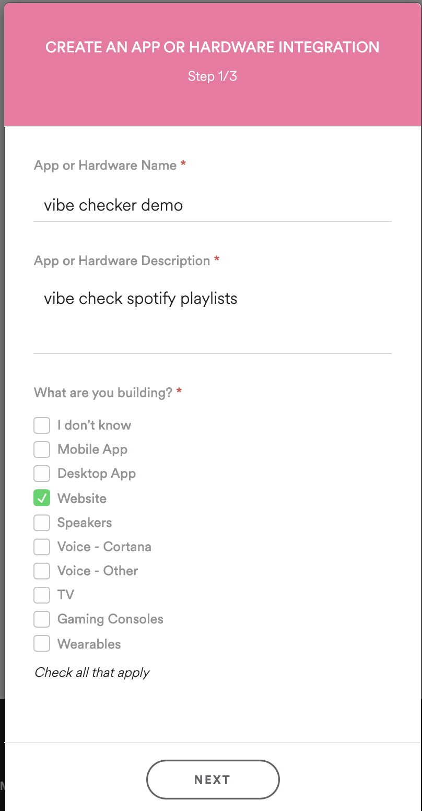

# spotify-vibe-check


## This is a cheeky app to vibe check your spotify playlists!

### Check it out at [spotify-vibe-check.soneji.xyz](https://spotify-vibe-check.soneji.xyz)


## Setup

### Step 1

```sh
git clone https://github.com/overclockedllama/spotify-vibe-check.git

cd spotify-vibe check

npm install
```

### Step 2

 - Goto https://developer.spotify.com/dashboard/ and click `CREATE AN APP`
 

 - Fill in details:
  <br>

 - Choose `NON COMMERCIAL`

 - Accept Terms of Service

 - Click `Edit Settings` in the top right
 
 

 - Under `Redirect URIs` add `http://localhost:8888/callback` or replace `localhost` with any server hostname you plan to host this app. 

 - Click `Show Client Secret` in the top Left
 

 - Copy `Client ID` and `Client Secret` to `env.sample`

 - Rename `env.sample` to `.env`

### Step 3
Run:
```sh
npm run test
```
to setup a local test server at http://localhost:8888/ 

### (Optional) Step 4

This step is about running the software on a server with pm2 as a node process manager. 

You will need to instlal pm2 to get this script to work. pm2 can be installed using:
```sh
sudo npm install pm2@latest -g
```

Ensure your Redirect URIs are correct for your server's hostname in the [Spotify Dashboard](https://developer.spotify.com/dashboard/) and you update this block of code in `app.js`

```js
// change the if statement to your server's hostname and your redirect url you've set in spotify developer settings
if (os.hostname() == 'soneji.xyz'){
  var redirect_uri = 'https://spotify-vibe-check.soneji.xyz/callback'
} else {
  var redirect_uri = 'http://localhost:8888/callback'; // Your redirect uri
}
```

Run
```sh
npm run dist
```
which will set the app to run with pm2
